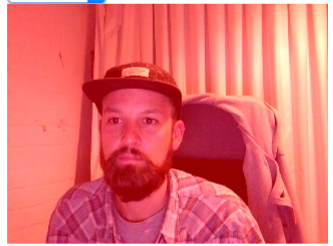
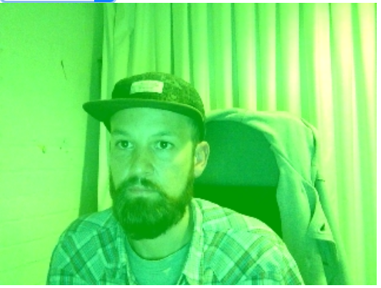
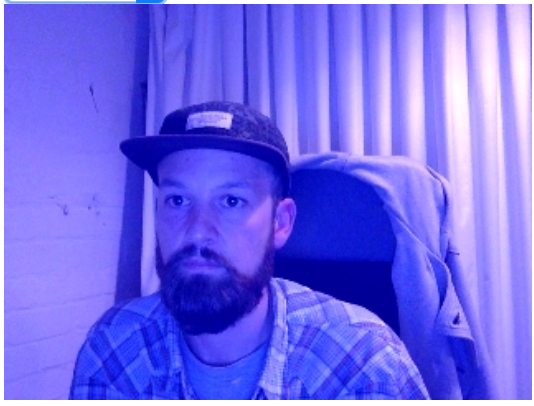
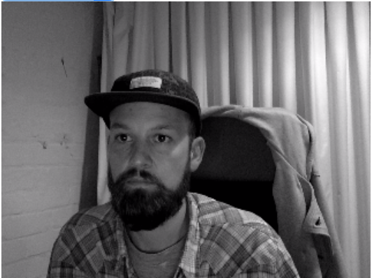
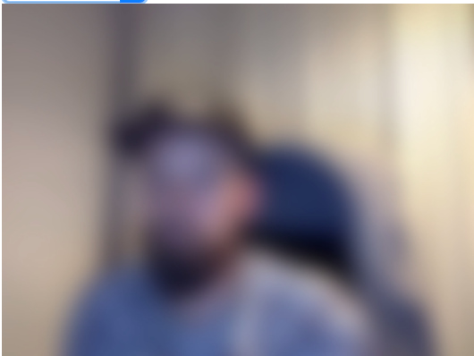
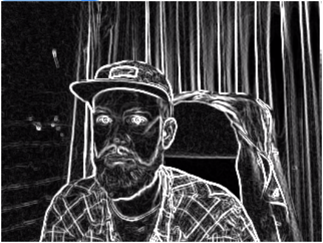
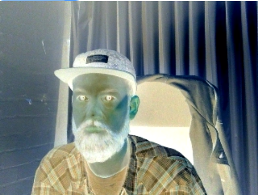
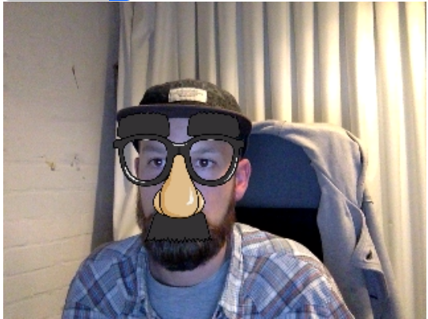

# opentok-camera-filters
library which lets you add visual filters to your OpenTok Publisher.

# [Demo](https://aullman.github.io/opentok-camera-filters/demo.html)

# Usage

You can view the [source code for the demo](https://github.com/aullman/opentok-camera-filters/blob/gh-pages/src/demo.js) for an example of how to use this library.

Include the filters and then initialise with the filter you want to use.

```javascript
const filters = require('opentok-camera-filters/src/filters.js');
const filter = require('opentok-camera-filters')(filters.none);
```

Then when you have a Publisher you need to set it, eg.

```javascript
const publisher = session.publish();
filter.setPublisher(publisher);
```

If you want to change the filter you can use the change method, eg.

```javascript
filter.change(filters.red);
```

If you're using the face filter you will need to setup the web worker. The worker expects a file at `'./js/faceWorker.bundle.js'`. The root of that JS file is [src/faceWorker.js](/src/faceWorker.js). So you need to point WebPack or Browserify at that file and put the output in the /js directory of your webserver.

# Available Filters

A lot of the filters were taken from [tracking.js](https://trackingjs.com).

## red
Give the video a red tint



## green
Give the video a green tint



## blue
Give the video a blue tint



## grayscale
Converts a colour from a colorspace based on an RGB color model to a grayscale representation of its luminance.



## blur
A Gaussian blur (also known as Gaussian smoothing) is the result of blurring an image by a Gaussian function.



## sketch
Computes the vertical and horizontal gradients of the image and combines the computed images to find edges in the image.



## invert
Inverts the colour in every pixel of the video.



## face
Does face detection using [tracking.js](https://trackingjs.com) and draws an image on top of the face.


